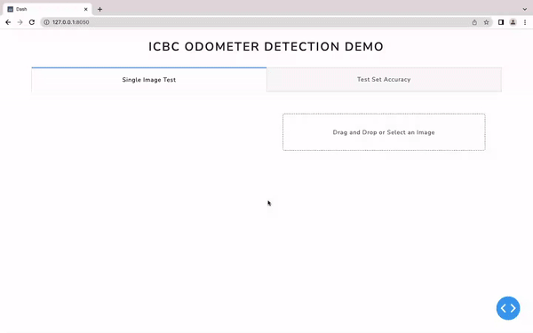
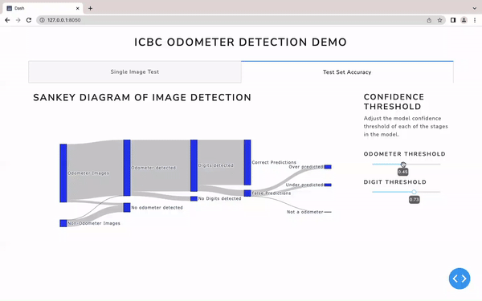

# ICBC-Odometer-Recognition
Image Recognition of Vehicle Odometer Readings. A [MDS](https://masterdatascience.ubc.ca) capstone project with the Insurance Corporation of British Columbia ([ICBC](https://www.icbc.com/Pages/default.aspx)).

**Contents**
- [Summary](#summary)
  - [Introduction](#introduction)
  - [Objectives](#objectives)
  - [Data](#data)
  - [Approach](#approach)
  - [Results](#results)
  - [Web Application](#web-application)
  - [Timeline](#timeline)
- [Directory Structure](#directory-structure)
- [Usage](#usage)
- [Dependencies](#dependencies)
- [Team and Contributors](#team-and-contributors)

## Summary

A project summary is included below. See the [Project Proposal Report](/docs/proposal_report.pdf) for more detail. 

### Introduction

ICBC offers premium discounts to drivers who travel below a specific annual mileage threshold. To verify the mileage, drivers are required to upload a photo of their vehicle's odometer, and the photo is manually reviewed by ICBC employees. The manual verification process has become impractical in terms of time and resources as the volume of submitted images grows and ICBC is seeking a technological solution. Our goal is to use machine learning techniques to create a solution that accurately annotates odometer readings, customized to support ICBC's low distance insurance program and reduce the manual workload for employees.

### Objectives

This project will explore the viability of automating the odometer verification process and present a workflow that addresses the following primary objectives:

* Develop a solution that emulates the manual odometer verification process, with the following elements:

  - accurately identifying the region of the odometer in an image

  - extracting the displayed mileage

  - providing confidence metrics for each digit and the overall reading

* Provide an interactive demonstration of the system, showcasing its capabilities and highlighting the potential benefits it offers.

* Identify limitations and challenges of bringing the system to production.

The primary factor for measuring the success of our model is its ability to produce accurate odometer readings. ICBC has established a minimum accuracy benchmark of 90% to safeguard the company's reputation, as a wrong reading could have adverse consequences.

### Data

ICBC has provided a dataset comprising 19,038 images of vehicle dashboard containing odometers, which included metadata annotations for the Make, Model, and Year of the vehicles. To train our models, we annotated a subset of 7,606 images in order to get corresponding text files containing the bounding box coordinates of the odometer. We also used open source datasets with images of digits that were already labeled. 

In our test data, we included two sets of images. The first set consisted of a second batch of 5,956 images from ICBC. Each image was accompanied by a verified odometer reading, enabling us to compare this value with the predictions made by our models. This allowed us to compare the predicted values generated by our models with the actual readings. The second set consisted of 721 non-class test images collected from various online datasets.

Images provided by ICBC are sourced from policy holder submissions during the pilot of the low-mileage discount program. 

For a complete analysis of the data, please refer to the [Proposal Report](docs/proposal_report.pdf) and [EDA](/eda/eda.pdf).

### Approach

Our pipeline uses two object detection models at different stages, each serving a specific purpose: (1) for identifying the location of the odometer and (2) for identifying the digits in the odometer. 

The process begins by resizing an input image and passing it through through the first model for odometer detection. According to the prediction it makes regarding the location of the odometer, the image will be cropped and resized again to be inputted into the second model for digit detection. 

At the end of our pipeline, a JSON file is generated as output, which includes the odometer reading along with confidence levels for the odometer identifiation and each identified digit. By applying a threshold to these confidence levels, uncertain predictions can be filtered out, leading to improved accuracy. 


### Results

Since our models are detecting two different things, we set different confidence thresholds for defining detection.

The results from our test set of 6,677 images is below. 

| Odometer Detection Model at 0.75 Confidence Threshold |-|
|----|--|
| Detection Rate | 5,104 / 6,677 odometers detected (76.4%) |
| Success Rate | 5,098 / 5,104 images actually containined odometers (99.9%) | 

| Digit Detection Model at 0.85 Confidence Threshold |-|
|----|--|
| Detection Rate | 3,529 / 5,104 digits detected (69.1%) |
| Success Rate | 3,365 / 3,529 digits read correctly (95.3%) | 

### Web Application

Our data product is a web app that provides a user-friendly interface for the partner to interact with and analyze the results of our model.

In Tab 1, the user can upload an image to see how our models perform on that specific image. The the predicted location of the odometer and the predicted digits are displayed on the original image. A table will display the predictions and confidence levels, with any confidence below a specified value highlighted in red.



Tab 2, presents a Sankey Diagram of the the distribution of the test set as it progresses through stages of our pipeline. Users can adjust the confidence thresholds for both models using a slider. This feature shows the impact on the number of rejected images requiring manual review and the number of images processed through the pipeline for predictions. 



### Timeline

| Completion Date | Milestone Description |
|----|----|
| Friday, May 12 | Milestone 1 - Scoping |
| Tuesday, May 23 | Milestone 2 - Model Selection |
| Friday, May 26 | Milestone 3 - MVP |
| Thursday, June 1 | Milestone 4 - Fine Tuning |
| Monday, June 12 | Milestone 5 - Final Model |
| Friday, June 16 | Milestone 6 - Project Presentation |
| Friday, June 28 | Milestone 7 - Final Product Transfer |

## Directory Structure

After you clone the project, you will need to ensure the directory structure is the same as below. 
Notably, the `tmp` folder will have to be manually re-created as it contains dataset files necessary for training and evaluation. 

    .
    ├── docs                    # Documentation files
    ├── eda                     # Exploratory Data Analysis
    ├── notebooks               # Project Notebooks   
    ├── outputs                 # Model files and evaluation results
    ├── src                     # Source files
    ├── tmp                     # Temporary files including datasets obtained from icbc
    │   ├── digits_with_labels
    │   │   └── ...
    │   ├── ICBC_imgs
    │   │   ├── 2018 Photos
    │   │   ├── 2019 Photos
    │   │   ├── 2022 Photos - 1
    │   │   ├── 2022 Photos - 2
    │   │   ├── 2022 Photos - 3
    │   │   ├── 2023 Photos
    │   │   ├── Photos 2
    │   │   ├── Photos 3
    │   │   ├── Photos 4
    │   │   └── Photos_1
    │   ├── icbc_labelled_split
    │   │   └── ...
    │   └── Test Data
    │       ├── Non-Odometer_Images
    │       │   ├── alarm clocks
    │       │   ├── car plates
    │       │   └── etc.
    │       └── Odometer_Photo_Readings
    │           ├── 20230416
    │           ├── ...
    │           ├── 20230430
    │           ├── 20230501
    │           ├── ...
    │           ├── 20230519
    │           └── Odometer_Photo_reading.xlsx
    ├── CODE_OF_CONDUCT.md
    ├── CONTRIBUTING.md
    ├── env.yml
    ├── makefile
    ├── README.md
    └── TEAMWORK_CONTRACT.md

## Usage

1. Clone this GitHub repository
2. Download ICBC data to `tmp/ICBC_data`
3. Install the [dependencies](#dependencies) listed below
4. Run the following command(s) in the command line/terminal from the root directory of this project:
    - generate project proposal
        > `make proposal`
    - generate eda
        > `make eda`
    - train models
        > `make train`
    - evaluate models
        > `make evaluate`
    - generate final report
        > `make report`
    - generate necessary files to run app
        > `make app`
    - clean `/tmp` files
        > `make clean`
    - run the webapp
        > `python src/app.py`

> Note: The following dependencies chain:
> - `make train` -> `make evaluate` ->`make report`
> - `make train` -> `make evaluate` ->`make app`
>
> Hence, if retraining is necessary (i.e. by updating the training notebooks) a potentially very long execution process may be undertaken. 
## Dependencies

The dependencies are listed in `env.yml`. 

To install the dependancies in a virtual conda environment:

```bash
conda env create --file env.yml
```
To activate the conda enviroment:
```bash
conda activate icbc
```

## Team and Contributors 
Team Members:
- Roan Raina ([@roanraina](https://github.com/roanraina))
- Renee Kwon ([@renee-kwon](https://github.com/renee-kwon))
- Sam Li ([@Hongjian-Sam-Li](https://github.com/Hongjian-Sam-Li))
- Bruce Wu ([@BruceUBC](https://github.com/bruceubc))

Mentor:
- Simon Goring ([@simongoring](https://github.com/SimonGoring))

Client (ICBC) : 
- Eric Li, Sr. Manager for Digital @ ICBC
