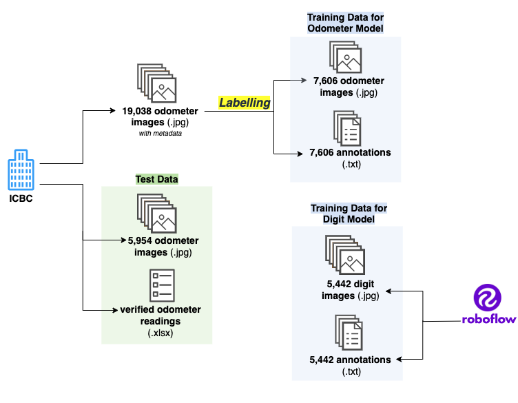
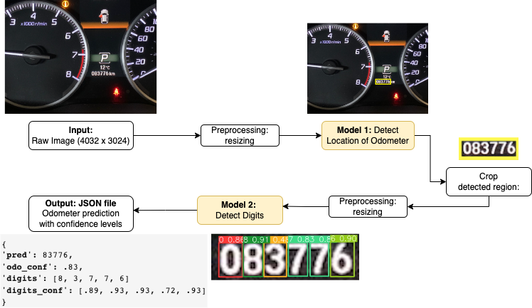
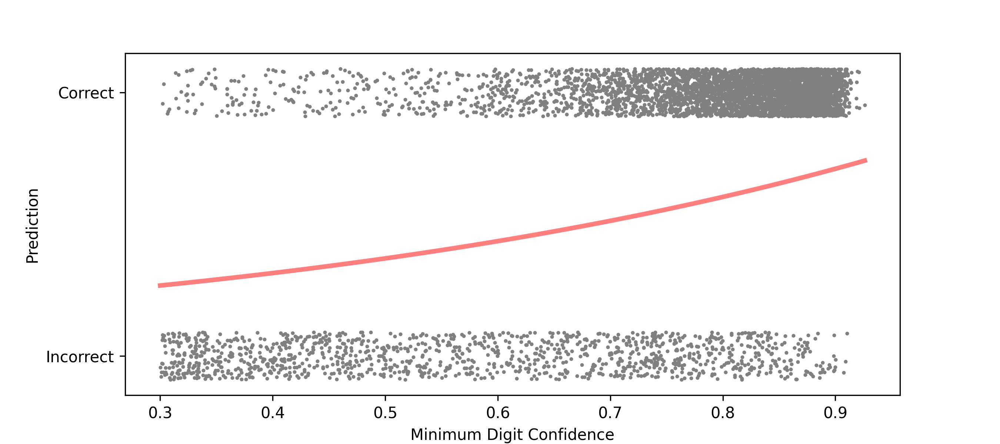
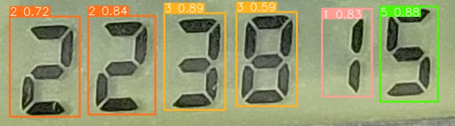
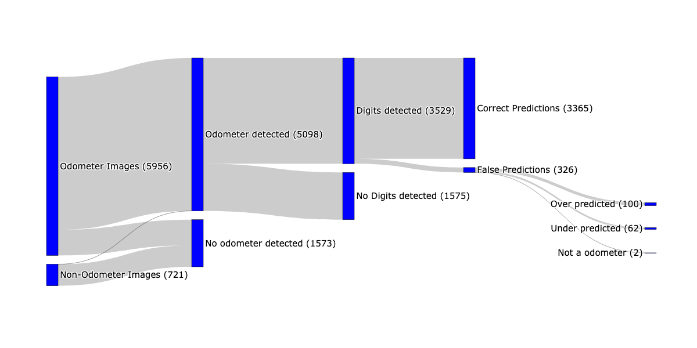

```{r setup, include=FALSE}
knitr::opts_chunk$set(echo = FALSE)
library(knitr)
library(kableExtra)
library(tidyverse)
library(purrr)
library(dplyr)
library(jsonlite)
library(kableExtra)

options(digits = 2)
```

```{r read results, include=FALSE}
# read results_df
results_data <- fromJSON('../outputs/Test_Data_Results.json',  simplifyVector = FALSE, simplifyDataFrame = FALSE)
results_data <- lapply(results_data, function(x) {
  x[sapply(x, is.null)] <- NA
  unlist(x)
})

results_df <- data.frame(PHOTO_FILE_PATH = unlist(results_data$PHOTO_FILE_PATH),
                   VIN = unlist(results_data$VIN),
                   VERIFIED_ODOMETER_READING = unlist(results_data$VERIFIED_ODOMETER_READING),
                   pred = unlist(results_data$pred),
                   odo_conf = unlist(results_data$odo_conf),
                   value_conf = unlist(results_data$value_conf))

results_df$match <- results_df$VERIFIED_ODOMETER_READING == results_df$pred
results_df$match <- as.numeric(results_df$match)

# set thresholds
odo_threshold = sprintf("%.2f", 0.75)
digit_threshold = sprintf("%.2f", 0.85)

# test data of only odometer images
n_test <- nrow(results_df)

# odo performance
odo_detect <- results_df %>% filter(odo_conf > odo_threshold)
n_odo_detect <- nrow(odo_detect)
perc_odo_detect <- sprintf("%.0f%%", n_odo_detect / n_test * 100)

# non odometer images identified as odometer
non_odo_detect <- nrow(results_df %>%
  filter(
    grepl("^Non-Odometer_Images", PHOTO_FILE_PATH) & odo_conf > 0.75
  ))

#odometer images not detected
perc_odo_undetect <- sprintf("%.0f%%", 100 - (n_odo_detect / n_test) * 100)

# odometer success rate
odo_success_rate <- sprintf("%.1f%%", n_odo_detect / (n_odo_detect + non_odo_detect)* 100)

# digit performance
digit_detect <- results_df %>% filter(value_conf > digit_threshold, odo_conf > odo_threshold)
n_digit_detect <- nrow(digit_detect)
perc_digit_detect <- sprintf("%.0f%%", n_digit_detect / n_odo_detect * 100)

# correct predictions
n_match <- sum(digit_detect$match == 1, na.rm = TRUE)
perc_match <- sprintf("%.0f%%", n_match / n_test * 100)

# digit_success_rate
digit_success_rate <- sprintf("%.0f%%", n_match / n_digit_detect * 100)
digit_failure_rate <- sprintf("%.0f%%", 100 - (n_match / n_digit_detect) * 100)

# decrease in manual review required images
perc_decrease_manual_review <- sprintf("%.0f%%", (n_test - (n_test-n_odo_detect) - (n_odo_detect-n_digit_detect)) / n_test * 100)
```

# Executive Summary

The Insurance Corporation of BC (ICBC) seeks a solution to streamline
the process of verifying odometer readings for their "low-kilometer
discount" program. The solution should reduce the manual effort while
ensuring high accuracy and reliability. Our proposed data product aims
to address this challenge by developing a functional computer vision
pipeline. Our pipeline will provide mileage predictions with confidence
levels from raw odometer readings. The confidence levels support
visualizations of the tradeoff between model accuracy and the volume of
photos that are being processed by the model, supporting further model
tuning. Recommendations are provided to improve the workflow to reduce
the degree of manual verification and to enhance the workflow
robustness.

# Introduction

The Insurance Corporation of British Columbia (ICBC) is a provincial
Crown corporation established in 1973 to provide auto insurance to
drivers in British Columbia. ICBC offers premium discounts to drivers
who travel below a specific annual mileage threshold. To verify the
mileage, drivers are required to upload a photo of their vehicle's
odometer, and the photo is manually reviewed by ICBC employees.

The manual verification process has become impractical in terms of time
and resources as the volume of submitted images grows. Relying solely on
manual review for obtaining odometer readings introduces the possibility
of inaccuracies and unreliability. Such errors can lead to severe
consequences, including allegations of fraud, customer dissatisfaction,
and damage to the company's reputation. ICBC is seeking a technological
solution to tackle these challenges. Our objective is to address this
issue by leveraging computer vision and machine learning techniques. We
aim to provide a solution that offers precise and reliable annotation of
odometer readings, specifically tailored to support ICBC's low distance
insurance program and alleviate the manual workload for employees.

# Objectives

This project will explore the viability of automating the odometer
verification process and present a workflow that addresses the following
primary objectives:

-   Develop a solution that emulates the manual odometer verification
    process, with the following elements:

    -   accurately identifying the region of the odometer in an image

    -   extracting the displayed mileage

    -   providing confidence metrics for each digit and the overall
        reading

-   Provide an interactive demonstration of the system, showcasing its
    capabilities and highlighting the potential benefits it offers.

-   Identify limitations and challenges of bringing the system to
    production. Factors such as lighting conditions, image quality, and
    variations in odometer designs can impact the system's accuracy and
    recognizing these limitations is vital to establish realistic
    expectations and define the boundaries of the system's performance.
    The impact of the system extends to key stakeholders, including ICBC
    and insurance customers. Please refer to Appendix 1 for a detailed
    overview of the stakeholders' interests.

The primary goal is to demonstrate the effectiveness and reliability of
the system, with a focus on achieving a high accuracy rate. In a
production environment, where maintaining a positive reputation is
vital, ensuring a minimum accuracy level of 90% is crucial. This
establishes a strong foundation for future improvements and
advancements, and proves the system's ability to deliver reliable
results in real-world scenarios.

# Dataset

Figure 1 shows the sources of our data for training and testing our
models. ICBC initially provided a dataset comprising 19,038 images of
odometers, which included metadata annotations for the Make, Model, and
Year of the vehicles. This dataset lacked annotations regarding the
location of the odometer and its digits, which is essential for training
object detection models. To address this, we annotated a subset of 7,606
images by adding bounding boxes around the odometers. In addition, we
used publicly accessible online datasets from a platform called Roboflow
that came with already annotated images of different digits. Finally,
our test data was a second batch of `r nrow(results_df)` images from
ICBC. Each image was accompanied by a verified odometer reading,
enabling us to compare this value with the predictions made by our
models.

```{r Fig1, fig.align = 'center', fig.cap="Sources and Preparation of Train and Test Data: During the labeling process, text files are created for each image, specifying the coordinates of the odometer and digits within the images. These files, along with the images, are then used to train the object detection models. For testing, ICBC provided a spreadsheet with verified odometer readings for each test image and these readings were then compared to the predictions of our models.", out.width = '70%'}

```

# Data Science Methods

## Pipeline

We initially experimented with programs such as EasyOCR and Tesseract.
We discovered the limitations of the initial optical character
recognition (OCR) approach for our project due to the substantial visual
complexity in dashboards and the abundance of irrelevant numerical data.

We chose an alternative approach, depicted in Figure 1, where we employ
two object detection models at different stages, each serving a specific
purpose: (1) for identifying the location of the odometer and (2) for
identifying the digits in the odometer. The process begins by resizing
an input image to a maximum width or height of 1280 pixels. The resized
image is then passed through the first model, the odometer detection
model, and a prediction is made for the location of the odometer. The
image will be cropped according to this prediction and resized to a
maximum width or height of 320 pixels and inputted into the second
model, the digit detection model. At the end of our pipeline, a JSON
file is generated as output. This file will includes the odometer
reading along with confidence levels for the odometer identifiation and
each identified digit. Additionally, the reading is subject to further
filtering. For instance, the system checks if the prediction contains an
excessive number of values. If it does, only the first six values are
presented.

```{r Fig2, fig.align = 'center', fig.cap="Odometer Reading Pipeline: The process of going from an input image to an odometer prediction with confidence levels.", out.width = '70%'}

```

## Modeling

We used YOLOv8 (You Only Look Once)[^1], an object detection model
developed by Ultralytics for both the odometer detection model and the
digit detection model. YOLOv8 performed better than an alternative model
we experimented with called FasterRCNN[^2]. It was easier to implement,
offered quicker training and prediction speeds, and required a smaller
amount of data to achieve satisfactory results, which was a significant
consideration for us as we annotated our own training data.

[^1]: Redmon, J., Divvala, S., Girshick, R. and Farhadi, A. (2016) You
    Only Look Once: Unified, Real-Time Object Detection. IEEE Conference
    on Computer Vision and Pattern Recognition, Las Vegas, 779-788.
    <https://doi.org/10.1109/CVPR.2016.91>

[^2]: Ren, S., He, K., Girshick, R., & Sun, J. (2015). Faster R-CNN:
    Towards Real-Time Object Detection with Region Proposal Networks. In
    *Advances in Neural Information Processing Systems (NIPS)*.

When training our Yolov8 models, we resized and added padding to the
images to achieve a square shape. Following this step, the pixel values
were normalized, and the images were converted into tensors for further
processing. For the odometer identification model, we selected an image
size of 1068 pixels by 1068 pixels, which served as a suitable midpoint
for accommodating the varying image sizes in our dataset. As for the
digit model, we opted for an image size of 320 pixels by 320 pixels.

Figure 2 displays the output at the end of our pipeline: a JSON file
containing the predicted odometer reading and confidence levels for both
odometer identification and individual digit predictions. Notably, the
predictions of the odometer include all odometer predictions and all
digit predictions, even those predicted with a very low confidence
level. Figure 3 demonstrates the relationship between the minimum
confidence level of digit predictions and the accuracy of the overall
prediction. By applying a threshold to this confidence level, uncertain
predictions can be filtered out, leading to improved accuracy. In the
Results section, we will explore how ICBC can utilize this filtering
mechanism for improved results.

```{r Fig3, fig.align = 'center', fig.cap="Minimum Confidence Level of Digits vs. Prediction Accuracy: The gray data points represent the minimum confidence level of the digits in the prediction and indicate whether the prediction was correct or not. The red curve illustrates the trend of higher prediction accuracy with higher minimum confidence, meaning if the model is unsure about one of it's digit predictions, the prediction is likely to be wrong.", out.width = '70%'}

```

\newpage

# Results

As our two models are detecting two different things, we have to set
different probability thresholds for defining detection.

For the odometer detection, we started out with our entire test set of
`r n_test` images. We set a threshold confidence threshold of
`r odo_threshold`, so that if the model predicts an odometer, it is
predicting it with a high confidence. Out of all the images, we detected
an odometer in `r n_odo_detect` images, at a detection rate of
`r perc_odo_detect`. The remaining `r perc_odo_undetect` does contain
images where there is an odometer but the model was not able to detect
it, possibly because the image is not clear enough or the image is of a
vehicle of a newer model that is underrepresented in our training data.
Of the `r perc_odo_detect` of odometers detected, we have a success rate
of almost `r odo_success_rate`, meaning if there is an odometer detected
with confidence by our model, we are right about it almost
`r odo_success_rate` of the time. There are `r non_odo_detect` images
where an odometer was detected in a non-odometer image. Overall, this
model achieved impressive results despite the variability in
photographed dashboards.

For digit detection, we set a higher threshold for the mileage detection
at `r digit_threshold` because detection of the digits turned out to be
a much more complicated process. We needed a higher threshold to be able
to distinguish between similar looking digits like 1s and 7s, and 3s and
8s, such as in Figure 2. Out of the `r n_odo_detect` identified odometer
regions from the first model, digits were detected in `r n_digit_detect`
cropped images at a confidence level of `r digit_threshold` or higher
(`r perc_digit_detect` detection rate). This second model in our
pipeline did not perform as well in detection, potentially due to the
usage of online public digit datasets rather than our own dashboard
image data. Of the `r n_digit_detect` of cropped images that there was a
detection, `r n_match` were read correctly, resulting in a success rate
of `r digit_success_rate`. This means that if our digit detection model
was confident in it's predictions, it was correct `r digit_success_rate`
of the time. The `r digit_failure_rate` of images where the model
predicting incorrectly with confidence can potentially be reduced by
setting rules on the predictions, for example, restricting the odometer
prediction to be higher than the policyholder's mileage from the
previous year.

```{r Fig4, fig.align = 'center', fig.cap="Misidentification of Digits: The digit model wrongly identified a 3 as an 8 in this prediction, and the confidence level for this digit is noticeably lower compared to the others at 0.59. At a confidence threshold higher than the average confidence level of all the digits, this photo would be rejected and sent to manual review.", out.width = '50%'}

```

Figure 5 presents the distribution of the test set as it progresses
through stages of our pipeline. Initially, images undergo a filtering
process using the confidence thresholds. If the odometer prediction
confidence is low or there is no odometer predicted by the first model,
the images are subjected to manual review. In the next stage, digit
predictions are made, and if the confidence levels falls below a
specific threshold, the images are passed for manual review. Images that
successfully pass both stages are returned with predictions, enabling us
to visualize the count of correct and incorrect predictions.

Out of our test dataset, a total of `r n_test - (n_digit_detect)` images
were rejected based on confidence thresholds of `r odo_threshold` for
the odometer detection and `r digit_threshold` for the digit detection,
and these images were rejected for manual review. The number of images
that would be require manual verification reduced from `r n_test` to
`r n_test - n_digit_detect` images, a decrease of
`r perc_decrease_manual_review` while maintaining an accuracy of
`r digit_success_rate`.

```{r Fig5, fig.align = 'center', fig.cap="The flow of test images through our pipeline", out.width = '80%'}

```

Lowering the thresholds can potentially improve accuracy by lowering the
number of false predictions. It would result in more images being
rejected along the prediction pipeline and increase the number of images
needing manual review.

ICBC places a strong emphasis on high confidence and prediction
accuracy, considering the potential impact of incorrect predictions on
costs and reputation. However, to make the process more efficient and
reduce the need for manual verification, there are situations where a
slight decrease in accuracy might be tolerated in order to include more
images in the automated process.

Thus, finding the optimal threshold involves balancing accuracy,
operational efficiency, customer satisfaction, and the need for manual
verification, aligning with ICBC's operational goals.

## Ethical concerns

It is crucial to recognize and mitigate potential ethical considerations
related to image quality, variations in cameras, and vehicle
characteristics, as these factors could be linked to a person's
socioeconomic status. To determine the make, model, and manufacturing
year of vehicles, we used the VIN (Vehicle Identification Number)
associated with the insurance policy and the submitted image. Our
analysis of the test set demonstrated no significant correlation between
vehicle attributes and the confidence levels of the models, as
illustrated in Figure 6.

We did notice a slight decline in the confidence levels of odometer
predictions in recent years (Figure 7a), which can be attributed to the
introduction of new methods of displaying odometers in newer vehicles,
including smartphone applications and integrated LCD screens. Our model
was not trained specifically on these advanced methods, which may
contribute to the lower confidence levels observed.

The fluctuation in the average confidence levels of both models during
the earlier years, specifically up to 1995, can be attributed to the
limited availability of images for older types of odometers.

```{r Fig6, fig.align = 'center', fig.cap="Models' Confidence by Manufacturing Year: Each point on the plot represents a prediction, showing the manufacturing year of the photographed vehicle and the confidence levels of the odometer detection model and the digit detection model. The red line depicts the average confidence level for each year.", fig.subcap=c('Odometer Confidence by Manufacture Year', 'Digit Confidence by Manufacture Year'), out.width = '45%', fig.ncol = 2}
knitr::include_graphics(c("../tmp/report/final_report_Fig6a.png", "../tmp/report/final_report_Fig6b.png"))
```

In our analysis, no significant relationships were found between image
attributes and model confidence. However, it remains crucial to further
investigate this aspect to ensure fairness for all users and mitigate
potential issues like slower verification times, unfair denial of
benefits, or inaccurately assigned lower rates that could arise from
varying levels of access to high-quality cameras.

Continuous evaluation of the model with a focus on ethical
considerations should be an ongoing practice to ensure fairness and
accuracy in its broader implementation..

# Data product

Our data product is a web app that provides a user-friendly interface
for the partner to interact with and analyze the results of our model.
The web app consists of two tabs as shown in Figure 7.

```{r Fig7, fig.align = 'center', fig.cap="The two tabs of the web application.",fig.subcap=c('Tab 1: Single Image Prediction', 'Tab 2: Interactive Sankey Diagram'), out.width = '100%', fig.ncol = 1}
knitr::include_graphics(c("img/final_report_Fig7a.png", "img/final_report_Fig7b.png"))
```

In Tab 1 (Figure 7a), the user can upload an image to see how our models
perform on that specific image. The results are displayed as the
original image with the predicted location of the odometer and the
predicted digits in the cropped image. A table will display the
confidence levels, with any confidence below a specified value
highlighted in red.

Tab 2 (Figure 7b) presents the Sankey Diagram from Figure 5 where the
user can adjust the confidence thresholds for both models using a
slider. This feature shows the impact on the number of rejected images
requiring manual review and the number of images processed through the
pipeline for predictions. It provides valuable insights into the
trade-off between accuracy and the quantity of predicted objects.

Pros of using this product include its user-friendly nature, making it
easy for executives and non-technical stakeholders to understand and
interpret the model's performance. It also meets the specific
requirements of the partner, unlike other alternatives such as notebooks
or reports which may lack explainability and interactivity. As a result,
the web app provides a balanced solution that is both user-friendly and
tailored to the partner's needs.

## Enhancements

During the production stage, the pipeline can be integrated into a
mobile or web app, providing customers with a convenient and efficient
method to verify their vehicle odometers. The app can incorporate non-ML
solutions, such as rejecting images that do not meet predefined criteria
before processing. Additionally, the app can offer users comprehensive
instructions and guidance on capturing suitable odometer photos, using
visual prompts, step-by-step instructions, or real-time feedback. This
helps users position their cameras accurately and avoid common issues
like reflections or blurriness. By excluding low-quality or irrelevant
images, the app enhances the likelihood of accurate predictions from our
models.

We can also incorporate user verification and correction into the
workflow. Allowing users to review and correct the model's annotations
on their images would result in more labeled data and valuable insights
into models' accuracy. However, due to time and resource limitations, we
decided not to implement these enhancements. Our focus was on delivering
a functional product considering integrating new processes would require
close collaboration with ICBC's internal development teams who have a
better understanding of the current infrastructure.

# Conclusion

We created a technology solution for ICBC to simplify their
"low-kilometer discount program" and reduce manual work. Our product
includes a pipeline for predicting odometer readings from images and
includes a user-friendly web app for visualizing the results. ICBC can
use our product to assess accuracy and reduce manual labor with
confidence thresholds, making informed decisions for their discount
program.

Although our overall pipeline was a success, our second model for
identifying digits didn't perform as well as expected. Nevertheless,
there are several opportunities for enhancement. For instance, training
the digit identification model using labeled digit images from ICBC can
improve its performance. Moreover, developing a user-friendly app
tailored to customers can generate more labeled data to be fed back into
training the models.

To maintain success and improvement, we suggest continuously evaluating
and enhancing the models' performance. This involves monitoring ethical
concerns, addressing biases, and gathering feedback from ICBC employees
and customers. Regular updates to the models and the app, incorporating
new data and technology advancements, will contribute to long-term
effectiveness and efficiency.

\newpage

# Appendix A

The following table shows our primary stakeholder groups and detailing
the impact of our project outcome.

| Stakeholder                   | Value          | Detailed Description                                                                                                                                                                                                                       |
|------------------|------------------|------------------------------------|
| **ICBC**                      | Cost Effective | Given a large number of images, the review process should be cheap.                                                                                                                                                                        |
|                               | Reputation     | As a public insurer, ICBC is susceptible to public perception and thus carries high reputational risk.                                                                                                                                     |
|                               | Speed          | Images need to be validated with speed so insurance products can be sold in a timely manner.                                                                                                                                               |
|                               | Accuracy       | ICBC seeks to minimize the number of images that are incorrectly labeled. Specifically predictions that claim a lower odometer value than actual, thus incorrectly awarding discounts.                                                     |
| **Customer (Insuree/Driver)** | Speed          | Customers want to be able to determine their discount immediately.                                                                                                                                                                         |
|                               | Accuracy       | Customers want their discount to be correct and not be surprised by changes later. Customers would be particular concerned with images that claim a higher odometer value than actual, thus incorrectly disqualifying them from discounts. |
|                               | Scrutiny       | Customers do not want their images to be unnecessarily scrutinized.                                                                                                                                                                        |
