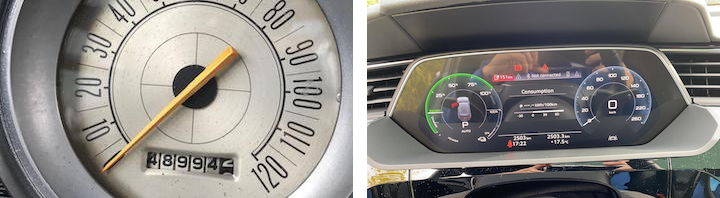

```{r setup, include=FALSE}
knitr::opts_chunk$set(echo = FALSE)
library(knitr)
library(kableExtra)
library(tidyverse)
```

```{r read eda, include=FALSE}
metadata_df <- read_csv("../tmp/proposal/metadata_df.csv")
image_quality_df <- read_csv("../tmp/proposal/image_quality_df.csv")
```

# Executive Summary

The Insurance Corporation of BC offers a discount on insurance premiums
to drivers who travel below a certain annual mileage threshold. In order
to qualify for the discount, drivers must submit images of their
odometers and this mileage is manually verified by a team member at
ICBC. This task is time-consuming and demands a high level of precision
from the public company, which is accountable to the people of BC. To
streamline this process and improve accuracy, we plan to develop a web
application that leverages image segmentation and optical character
recognition technologies. Our project will address challenges such as
variations in image quality, size, and odometer design, resulting in a
machine learning workflow that can accurately predict odometer readings,
assess precision and accuracy, and provide a means for ICBC to
incorporate the workflow into their process for providing low-mileage
driver discounts.

\newpage

# Introduction

ICBC is a provincial Crown corporation established in 1973 to provide
compulsory auto insurance to all drivers in British Columbia. It
presently offers discounts to its customers who drive fewer kilometres
than a specified amount in a year, referred to as "low-kilometre"
discounts. To verify the low mileage of their vehicle, customers enter
their current mileage and upload a photo of their vehicle's odometer
through a web app. The submitted image is then manually reviewed by a
team of workers at ICBC, and the verified odometer information is
entered into the customer's policy record. The issue lies in the
significant allocation of time and resources toward manually examining
each image. Furthermore, customers experience delays in receiving their
discounts while waiting for the manual review process.

The objective of the project is to develop a web application that can
take an image as input and use the model to recognize the image as a
vehicle, locate the vehicle odometer, extract the odometer number, and
provide confidence in the accuracy of the reading. The project's goal is
to ensure that the model achieves a minimum accuracy of 90% to mitigate
the potential impact of any inaccuracy on ICBC's customers in British
Columbia and the company's reputation.

# Data Description

Our dataset contains `r nrow(metadata_df)` images of odometer readings
captured between 2018 and 2023. Each image contains structured metadata,
as presented in Figure 1. Furthermore, we will receive another set of
images with corresponding odometer readings, which will serve as our
validation set to test the accuracy of our model.

```{r metadata, fig.align = 'center', fig.cap="The metadata of each image includes information about the connected policy's car, such as the make, model, and manufacturing year of the vehicle, which is stored in the form of exif data.", out.width = '50%'}

```

The diversity in the types of odometers displayed in the images is a
major challenge that we must address while working with this data, and
it poses a significant obstacle to achieving our model accuracy goal of
90%. According to The New York Times, mechanical odometers were replaced
with digital odometers in most cars by the early 2000s[^1].

[^1]: Stenquist, P. (2021b, May 20). Odometer Rollbacks: A Hard-to-Spot
    Nuisance for Car Shoppers. The New York
    Times.<https://www.nytimes.com/2021/05/20/business/odometer-fraud.html?smid=url-share>.

Our dataset mainly consists of images of vehicles manufactured after
2000, as depicted in Figure 2, but many cars were still produced before
that time. Figure 3 shows the substantial differences between the oldest
and newest cars of the subset of data.

\newpage

```{r year distribution, fig.align = 'center', eval = TRUE, fig.cap="Most of the cars in our dataset were manufactured in the past 20 years, with a peak observed around 2005. The red line in the plot represents an approximate time when digital odometers began to replace mechanical ones in most vehicles. However, we also observe a decline in the number of cars manufactured in recent years, which could potentially make it challenging for our model to identify the most advanced odometer displays.", out.width = '65%'}
knitr::include_graphics("../tmp/proposal/report_Fig2.png")
```

```{r old vs. new, fig.align = 'center', eval = TRUE, fig.cap="On the left is one of the earliest dashboard designs in our dataset, featuring the mechanical dashboard of a 1965 Dodge Dart model. In contrast, the image on the right displays the fully digital dashboard of a 2021 Audi Etron. The two images demonstrate the remarkable differences in dashboard designs between older and newer cars.", out.width = '80%'}

```

While the majority of our images come from popular car makes that likely
use standardized odometers, our dataset also includes many unique
vehicles. Therefore, in order to achieve our target accuracy goal, our
model must perform well on the less common vehicle types in our dataset,
despite their smaller representation.

```{r make chart, fig.align = 'center', eval = TRUE, fig.cap="More than 70 percent of the images in our dataset are attributed to the top 10 most prevalent car makes. Among these, Honda, Ford, and Toyota are the most frequent, accounting for 30 percent of the dataset.", out.width = '50%'}
knitr::include_graphics("../tmp/proposal/report_Fig4.png") 
```

\newpage

Additionally, the quality of the images could also pose a challenge. For
instance, figure 5a depicts a significant variation in contrast levels
between low and high contrast images. Another challenge with the dataset
is the wide range of image sizes with the smallest image at 180 x 320
pixels and the largest image at 12000 x 9000 pixels. This variation can
pose a challenge when training a machine learning model, as the input
data needs to be consistent in size for the model to learn effectively.
Appropriate preprocessing techniques, such as resizing, cropping, or
padding, contrast normalization and enhancement, may be employed to
mitigate the impact of varying image attributions on the model's
performance.

```{r contrast and dimensions, fig.align = 'center', fig.cap="The images typically have lower contrast levels, which is found by calculating the difference between the lightest and darkest pixel values in the image. The most common range being between 30 to 40. The plot on the right displays the distribution of image size ratios in our dataset. The 4:3, 16:9, and 3:2 ratios are the most commonly used ratios in consumer camera phones, which are the primary source of our data. Both these variations are dependent on various factors, such as lighting conditions, camera angles, camera quality, dashboard design, and more.", fig.ncol=2, fig.subcap=c("", ""), out.width = '40%'}
knitr::include_graphics("../tmp/proposal/report_Fig5a.png")
knitr::include_graphics("../tmp/proposal/report_Fig5b.png")
```

\newpage

# The Approach

During scoping, we explored off-the-shelf open-sourced Optical Character
Recognition (OCR) tools such as Tesseract and easyOCR. Tesseract, which
is optimized for recognizing text from scanners or cameras under good
lighting conditions, was largely unable to recognize the text in our
odometer images, which had varying font styles, resolutions, and
contrasts. EasyOCR performed better, being able to identify an
odometer-like value \~30% of the time. While the performance of these
tools could be improved via pre-processing, the low accuracy suggests a
more involved, specifically trained approach would be more appropriate.

Considering the objective outlined in the introduction, we propose the
following pipeline is as described in Figure 6 below. We considered
using a classification model as the first step to distinguish dashboard
photos from non-odometer images. However, we chose to skip this step and
use a segmentation model to detect potential odometer readings. If a
potential odometer reading cannot be detected with sufficient accuracy,
we can assume it is not an image of a vehicle.

```{r workflow, fig.align = 'center', fig.cap="The proposed Pipeline, divided into three separate stages: pre-processing, odometer detection, and value detection.", out.width = '90%'}
knitr::include_graphics("img/report_Fig6.jpg")
```

In the pre-processing stage, image manipulations such as resizing,
contrast controls, and filtering will be performed to make input images
more uniform. Image segmentation will isolate the odometer region of the
image, thereby removing extraneous numerical information such as trip
mileage, speed, and temperature. Finally, odometer value detection will
use the segmented image to extract the value, while being robust to
various types of odometer displays and image quality issues.

The dataset provided by ICBC is expected to be sufficient for these
learning tasks. However, for object detection tasks, training typically
requires labeled bounding boxes for each object class. This is not
provided in the ICBC dataset, only the value of the odometer is
provided. While alternative approaches could be employed to simulate the
bounding boxes, we have identified "TRODO: A public vehicle odometers
dataset for computer vision" as a potential data source with annotations
including the bounding boxes of odometer displays. This will allow us to
use a industry standard training process and likely improve model
performance.

# Success Criteria

The primary factor for measuring the success of our model is its ability
to produce accurate odometer readings. ICBC has established a minimum
accuracy benchmark of 90% to safeguard the company's reputation, as a
wrong reading could have adverse consequences. The ratio between over
and under-estimation needs to be tracked as each case has different
consequences for different stakeholders. In the under-estimation case,
the insurer faces a financial loss; in over-estimation cases, the driver
does not receive a discount. Furthermore, while a human-in-the-loop
system is most likely, the company aims to minimize the need for human
intervention, thereby reducing expenses and improving efficiency.
Furthermore, a model that can instantly read odometers without requiring
manual verification would enable customers to receive applicable
discounts, saving them time. With a high level of accuracy, customers
eligible for discounts can benefit from cost savings.

# Our Timeline

Below are the projected timelines and key milestones for our project:

-   **Friday, May 12 - Milestone 1: Scoping Complete**

    By this date, we will have completed scoping the project, which
    includes fully understanding the problem to be solved, defining the
    goals and objectives of the project, determining the stakeholders
    involved, and attempting the initial, fundamental approach to
    address the problem.

-   **Tuesday, May 23 - Milestone 2: Decide on the Best Model**

    By this milestone, we aim to have experimented with various models,
    determine the optimal approach, and identify the most promising
    model.

-   **Friday, May 26 - Milestone 3: Minimum Deliverable Product**

    We plan to finalize our machine-learning pipeline and ensure the
    code is no longer confined to notebooks. This milestone marks the
    minimum product that should be delivered to meet the project's
    requirements.

-   **Thursday, June 1 - Milestone 4: Fine Tuning Complete**

    On this date, we expect to have finished fine-tuning our model and
    completed thorough testing and evaluation to identify areas for
    further improvements.

-   **Monday, June 12 - Milestone 5: Final Model**

    After milestone four and before this date, we plan to make final
    adjustments to our model based on the results of our evaluations. We
    will have finalized the packaging of our model through a web
    application and created clear and concise, understandable
    documentation that will be accessible to developers and end-users.

-   **Friday, June 16 - Milestone 6: Final Presentations**

    Our final presentations will take place on this date.

-   **Wednesday, June 28 - Milestone 7: Final Product**

    By this date, we will have completed our final data product.
